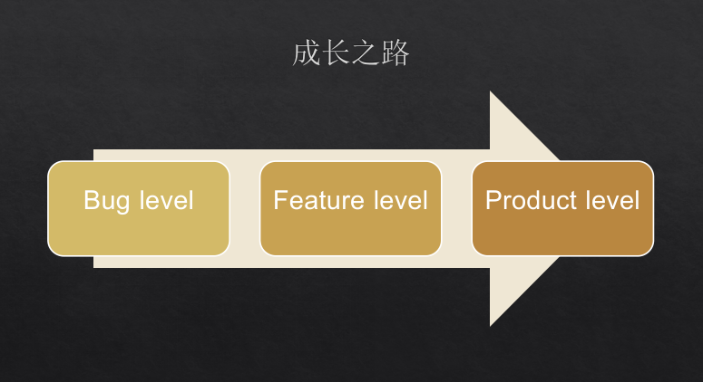
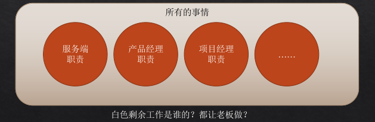

# 应届服务端工程师成长鸡汤

## 背景

作为一个开发多年工程师, 从懵懂愣头青到一杆枪, 到全员出击, 再到单枪匹马, 血凝凝感受到团队成员能力成长和团队业务传承是团队管理的重要关注点. 这里拾人牙慧 & 抛砖引玉想和大家谈谈**服务端工程师成长体系**. 给大家(特别是 **1 - 3 年应届生**)也包括自己, 还有基层团队管理者灌点鸡汤.

## 成长之路

### Bug level engineer

+ 时间
    + 工作 1 ～ 3 年
+ 工程与业务能力
    + 在指导下完成小模块开发
    + 在现有框架里完成功能
    + 能够与同事协作沟通
+ 技术深度
    + 计算机基础
    + 了解所有工作相关的基础工具、中间件的用法
    + 对于基础工具与中间件开始有一定程度的理解
+ 团队职责
    + **努力学习成长**

应届生前三年太重要了. 责任心, 工程素养, 未来路正不正, 工程师之路, 顺不顺 就看这三年社会大学了.

### Feature level engineer

+ 时间
    + 3 ~ 6 年
+ 工程与业务能力
    + 能够独立完成大型模块开发
    + 有一定的设计能力，能够设计中型功能
    + 能够独立搭建业务框架
    + 对于业务已经比较了解
    + 能够解决困难的线上问题
    + 能够做技术选型
    + 较了解其它研发岗位，对于技术以外综合能力有拓展
+ 技术深度
    + 深入了解常用工具与中间件的原理
    + 熟悉一般需求的各种方案与利弊
+ 团队职责
    + 维护线上服务稳定性，参与代码评审，维护团队代码质量
    + 需求评审的主要贡献者，设计与拆解任务
    + 主动提出各种改进方案，是团队的技术骨干，中坚力量
    + **带领初级工程师完成中型模块开发任务**

### Product level engineer

+ 时间
    + 5 ～ 10 年
+ 工程与业务能力
    + 大型项目的模块划分，整体设计
    + 能够熟练地进行系统分析，问题定义，概念抽象
    + 优秀地完成复杂系统中的核心关键点开发
    + **了解业务与技术中的深层次风险点**
    + **把握业务和技术的中长期发展方向**
    + **有成熟的产品观，了解业务与商业模式，拥有大局观**
+ 技术深度
    + **对于基础工具与中间件有深刻的理解**
    + 对于语言、技术、计算机、软件工程等都有深刻理解
    + 了解行业技术前沿发展动态，决定技术升级方向
+ 团队职责
    + **制定大型技术方案，业务分析**
    + 参与设计评审，给出问题的最优解决方案
    + 带领初中级工程师完成大型系统的设计与开发

## 服务端的职业素养

## 工程能力

**高质量代码是工业品，而不是手艺人拿来炫耀的玩意儿**

如何判定业务代码好和坏, 比你能力弱都能很好接住你业务代码. **你走了业务运转还是非常有条不絮.**

## 动手能力

**遇到问题查到底**

> “XXX 坏了”，“XXX 不靠谱” 是一种不专业的结论
哪行代码坏了？
什么原因导致的？
设计因素还是维护性因素？
如果是设计因素，一共有多少种设计，各有哪些优劣？
对自己今后设计其它系统有什么帮助？
**Bug 总会有**，但**不要在同一个问题上栽倒两次**

**如何处理线上问题**

> 3 分钟解决不了请先保留证据回滚
永远不要忽略错误信息
排查问题就是断案，讲究证据而不是猜测
制造证据，而不着急撸业务代码，那是最慢的方式
遇事先砍一刀：二分法
三方库报错，**看源码进去**，不要一开始就黑盒测试

**线上出事的时候最学东西** 

> 为什么压测不过
不加机器行不行
这条请求为什么慢了
对方慢了对方慢在哪里呢

**合适的时候做合适的事情**

> 不要太晚 
**技术债不能欠太多，该重构请重构** 
不要太早
**大公司的东西，未必适合我们现在做，现在做可能会成为负担**
**任何方案的产生，都是有他的需求和时代意义**
**请先了解它在解决什么问题**
**了解他的实现与维护成本**

**做了和搞定了是天差地别的境界**

>结果驱动，不要自我安慰
**想方设法搞定问题**
每到一个境界，“搞定”就有更高的含义
*顺势而为*

***

### 服务端的价值观

***

**承担责任，结果导向**

**对线上故障的敏感性**

**理性，靠谱，可依赖**

***

## 认识自我

### 直面成长和工作

+ 成长过程是曲曲折折的
+ 困难期的调整：
    + 降低预期，拉长战线，设定分期目标
    + 先抓主干，再丰满枝叶
+ 瓶颈期的调整：
    + 及时与自己的老大沟通
    + 你其实是看不到(或忽略了)更大的挑战
    + 重新审视自己的职业规划
+ 对工作乐趣的预期
    + **20% 工作内容是很爽很刺激就非常幸福的了**，不要刻意追求乐趣
    + **责任驱动，专业力驱动**

### 我们是开发工程师, 不是码农

我们的 Title 是 SDE (**Software Develop Engineer**)

从手工作坊员到工程师
**稳定容错**
与时俱进软件开发体系
**团队协作**

unit test 单元测试对**稳定容错**很有帮助

如何**稳定容错**呢, unit test 说不定是个好东西!

认同团队, 认同管理对 **团队协作** 很有帮助.

在管理学中, 一个管理者最多管理多少人有很多理论和前提和类型, 3 - 6人, 5 - 8人, 10 - 15人, 等等. 
类比到国内团队管理这么多人, 管理者自身也非常累和挑战, 需要对每个成员成长和业务以及上级领导最终结果负责. 

### 你的格局应当越来越大

+ 你职位的基本职责圈其实很小，然而你能做的事情却很多
+ 逐渐熟悉其它岗位的能力，逐渐锻炼自己达到领导的能力
+ 工程师只是商业的一环，逐渐了解商业

### 让你成功不是组织的目标

+ 请先证明自己
+ 对自己有一个合适的评估
+ 实现你的价值
+ 制定合理的目标
+ 突破自己最学东西
+ 管理好你的时间

**一切错都是我的错，我还不够强** 让你成功也不是团队的必要目标

## 领导力-团队管理

### 团队建设与发展

初始化：持续人才盘点，梯队建设。
服务端业务建设：完成业务白皮书，制定业务发展方向，积累业务知识库。
Back-Up：保证核心位置每个人都有备份，包括自己
One-One：定期一对一沟通，找到隐藏问题
人员成长：把下属分为技术骨干，管理骨干，黄牛员工，待观察，准淘汰等类型，分别按照特点分配不同项目，关注每一个人成长，打仗是最好的团建
目标规划：保证大团队有 1 ~ 2 年的技术规划，小团队有至少半年的技术规划，让眼界持续走在现实之前

### 管理理念

责任心第一：电商涉及大量钱与货，所有人最重要的素质就是责任心
不设边界：促使骨干员工推动和主持跨组项目，让每个人能理解电商不同领域
动态调整：组织随着业务变化调整，在调整的过程中，保证每个人能持续快乐成长
开放理念：代码开放，服务开放，团队技术共建；协助公司提高效率和产出
