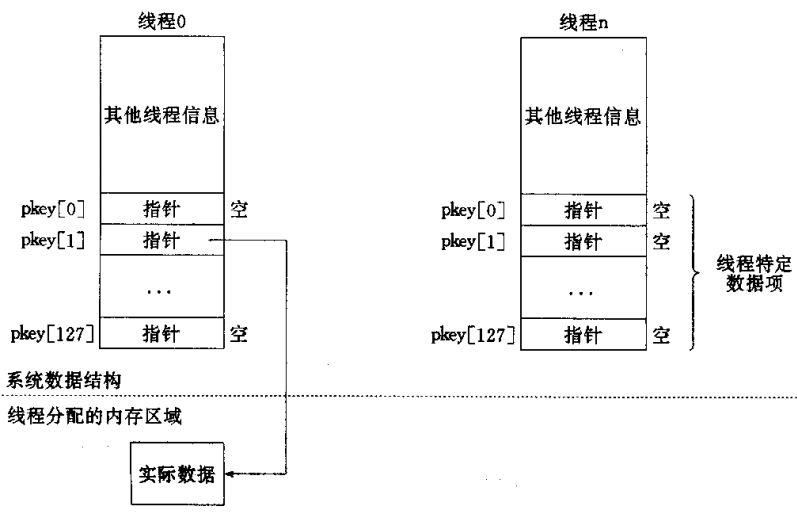

# errno-机制

## table convert 工具

[https://tableconvert.com/](https://tableconvert.com/)

## errno 对应表

| C Name          | Value | Description                                 | 含义              |
|-----------------|-------|---------------------------------------------|-----------------|
| Success         | 0     | Success                                     | 成功              |
| EPERM           | 1     | Operation not permitted                     | 操作不允许           |
| ENOENT          | 2     | No such file or directory                   | 没有这样的文件或目录      |
| ESRCH           | 3     | No such process                             | 没有这样的过程         |
| EINTR           | 4     | Interrupted system call                     | 系统调用被中断         |
| EIO             | 5     | I/O error                                   | I/O错误           |
| ENXIO           | 6     | No such device or address                   | 没有这样的设备或地址      |
| E2BIG           | 7     | Arg list too long                           | 参数列表太长          |
| ENOEXEC         | 8     | Exec format error                           | 执行格式错误          |
| EBADF           | 9     | Bad file number                             | 坏的文件描述符         |
| ECHILD          | 10    | No child processes                          | 没有子进程           |
| EAGAIN          | 11    | Try again                                   | 资源暂时不可用         |
| ENOMEM          | 12    | Out of memory                               | 内存溢出            |
| EACCES          | 13    | Permission denied                           | 拒绝许可            |
| EFAULT          | 14    | Bad address                                 | 错误的地址           |
| ENOTBLK         | 15    | Block device required                       | 块设备请求           |
| EBUSY           | 16    | Device or resource busy                     | 设备或资源忙          |
| EEXIST          | 17    | File exists                                 | 文件存在            |
| EXDEV           | 18    | Cross\-device link                          | 无效的交叉链接         |
| ENODEV          | 19    | No such device                              | 设备不存在           |
| ENOTDIR         | 20    | Not a directory                             | 不是一个目录          |
| EISDIR          | 21    | Is a directory                              | 是一个目录           |
| EINVAL          | 22    | Invalid argument                            | 无效的参数           |
| ENFILE\*        | 23    | File table overflow                         | 打开太多的文件系统       |
| EMFILE          | 24    | Too many open files                         | 打开的文件过多         |
| ENOTTY          | 25    | Not a tty device                            | 不是tty设备         |
| ETXTBSY         | 26    | Text file busy                              | 文本文件忙           |
| EFBIG           | 27    | File too large                              | 文件太大            |
| ENOSPC          | 28    | No space left on device                     | 设备上没有空间         |
| ESPIPE          | 29    | Illegal seek                                | 非法移位            |
| EROFS           | 30    | Read\-only file system                      | 只读文件系统          |
| EMLINK          | 31    | Too many links                              | 太多的链接           |
| EPIPE           | 32    | Broken pipe                                 | 管道破裂            |
| EDOM            | 33    | Math argument out of domain                 | 数值结果超出范围        |
| ERANGE          | 34    | Math result not representable               | 数值结果不具代表性       |
| EDEADLK         | 35    | Resource deadlock would occur               | 资源死锁错误          |
| ENAMETOOLONG    | 36    | Filename too long                           | 文件名太长           |
| ENOLCK          | 37    | No record locks available                   | 没有可用锁           |
| ENOSYS          | 38    | Function not implemented                    | 功能没有实现          |
| ENOTEMPTY       | 39    | Directory not empty                         | 目录不空            |
| ELOOP           | 40    | Too many symbolic links encountered         | 符号链接层次太多        |
| EWOULDBLOCK     | 41    | Same as EAGAIN                              | 和EAGAIN一样       |
| ENOMSG          | 42    | No message of desired type                  | 没有期望类型的消息       |
| EIDRM           | 43    | Identifier removed                          | 标识符删除           |
| ECHRNG          | 44    | Channel number out of range                 | 频道数目超出范围        |
| EL2NSYNC        | 45    | Level 2 not synchronized                    | 2级不同步           |
| EL3HLT          | 46    | Level 3 halted                              | 3级中断            |
| EL3RST          | 47    | Level 3 reset                               | 3级复位            |
| ELNRNG          | 48    | Link number out of range                    | 链接数超出范围         |
| EUNATCH         | 49    | Protocol driver not attached                | 协议驱动程序没有连接      |
| ENOCSI          | 50    | No CSI structure available                  | 没有可用CSI结构       |
| EL2HLT          | 51    | Level 2 halted                              | 2级中断            |
| EBADE           | 52    | Invalid exchange                            | 无效的交换           |
| EBADR           | 53    | Invalid request descriptor                  | 请求描述符无效         |
| EXFULL          | 54    | Exchange full                               | 交换全             |
| ENOANO          | 55    | No anode                                    | 没有阳极            |
| EBADRQC         | 56    | Invalid request code                        | 无效的请求代码         |
| EBADSLT         | 57    | Invalid slot                                | 无效的槽            |
| EDEADLOCK       | 58    | Same as EDEADLK                             | 和EDEADLK一样      |
| EBFONT          | 59    | Bad font file format                        | 错误的字体文件格式       |
| ENOSTR          | 60    | Device not a stream                         | 设备不是字符流         |
| ENODATA         | 61    | No data available                           | 无可用数据           |
| ETIME           | 62    | Timer expired                               | 计时器过期           |
| ENOSR           | 63    | Out of streams resources                    | 流资源溢出           |
| ENONET          | 64    | Machine is not on the network               | 机器不上网           |
| ENOPKG          | 65    | Package not installed                       | 没有安装软件包         |
| EREMOTE         | 66    | Object is remote                            | 对象是远程的          |
| ENOLINK         | 67    | Link has been severed                       | 联系被切断           |
| EADV            | 68    | Advertise error                             | 广告的错误           |
| ESRMNT          | 69    | Srmount error                               | srmount错误       |
| ECOMM           | 70    | Communication error on send                 | 发送时的通讯错误        |
| EPROTO          | 71    | Protocol error                              | 协议错误            |
| EMULTIHOP       | 72    | Multihop attempted                          | 多跳尝试            |
| EDOTDOT         | 73    | RFS specific error                          | RFS特定的错误        |
| EBADMSG         | 74    | Not a data message                          | 非数据消息           |
| EOVERFLOW       | 75    | Value too large for defined data type       | 值太大,对于定义数据类型    |
| ENOTUNIQ        | 76    | Name not unique on network                  | 名不是唯一的网络        |
| EBADFD          | 77    | File descriptor in bad state                | 文件描述符在坏状态       |
| EREMCHG         | 78    | Remote address changed                      | 远程地址改变了         |
| ELIBACC         | 79    | Cannot access a needed shared library       | 无法访问必要的共享库      |
| ELIBBAD         | 80    | Accessing a corrupted shared library        | 访问损坏的共享库        |
| ELIBSCN         | 81    | A \.lib section in an \.out is corrupted    | 库段\. out损坏      |
| ELIBMAX         | 82    | Linking in too many shared libraries        | 试图链接太多的共享库      |
| ELIBEXEC        | 83    | Cannot exec a shared library directly       | 不能直接执行一个共享库     |
| EILSEQ          | 84    | Illegal byte sequence                       | 无效的或不完整的多字节或宽字符 |
| ERESTART        | 85    | Interrupted system call should be restarted | 应该重新启动中断的系统调用   |
| ESTRPIPE        | 86    | Streams pipe error                          | 流管错误            |
| EUSERS          | 87    | Too many users                              | 用户太多            |
| ENOTSOCK        | 88    | Socket operation on non\-socket             | 套接字操作在非套接字上     |
| EDESTADDRREQ    | 89    | Destination address required                | 需要目标地址          |
| EMSGSIZE        | 90    | Message too long                            | 消息太长            |
| EPROTOTYPE      | 91    | Protocol wrong type for socket              | socket协议类型错误    |
| ENOPROTOOPT     | 92    | Protocol not available                      | 协议不可用           |
| EPROTONOSUPPORT | 93    | Protocol not supported                      | 不支持的协议          |
| ESOCKTNOSUPPORT | 94    | Socket type not supported                   | 套接字类型不受支持       |
| EOPNOTSUPP      | 95    | Operation not supported on transport        | 不支持的操作          |
| EPFNOSUPPORT    | 96    | Protocol family not supported               | 不支持的协议族         |
| EAFNOSUPPORT    | 97    | Address family not supported by protocol    | 协议不支持的地址        |
| EADDRINUSE      | 98    | Address already in use                      | 地址已在使用          |
| EADDRNOTAVAIL   | 99    | Cannot assign requested address             | 无法分配请求的地址       |
| ENETDOWN        | 100   | Network is down                             | 网络瘫痪            |
| ENETUNREACH     | 101   | Network is unreachable                      | 网络不可达           |
| ENETRESET       | 102   | Network dropped                             | 网络连接丢失          |
| ECONNABORTED    | 103   | Software caused connection                  | 软件导致连接中断        |
| ECONNRESET      | 104   | Connection reset by                         | 连接被重置           |
| ENOBUFS         | 105   | No buffer space available                   | 没有可用的缓冲空间       |
| EISCONN         | 106   | Transport endpoint                          | 传输端点已经连接        |
| ENOTCONN        | 107   | Transport endpoint                          | 传输终点没有连接        |
| ESHUTDOWN       | 108   | Cannot send after transport                 | 传输后无法发送         |
| ETOOMANYREFS    | 109   | Too many references                         | 太多的参考           |
| ETIMEDOUT       | 110   | Connection timed                            | 连接超时            |
| ECONNREFUSED    | 111   | Connection refused                          | 拒绝连接            |
| EHOSTDOWN       | 112   | Host is down                                | 主机已关闭           |
| EHOSTUNREACH    | 113   | No route to host                            | 没有主机的路由         |
| EALREADY        | 114   | Operation already                           | 已运行             |
| EINPROGRESS     | 115   | Operation now in                            | 正在运行            |
| ESTALE          | 116   | Stale NFS file handle                       | 陈旧的NFS文件句柄      |
| EUCLEAN         | 117   | Structure needs cleaning                    | 结构需要清洗          |
| ENOTNAM         | 118   | Not a XENIX\-named                          | 不是XENIX命名的      |
| ENAVAIL         | 119   | No XENIX semaphores                         | 没有XENIX信号量      |
| EISNAM          | 120   | Is a named type file                        | 是一个命名的文件类型      |
| EREMOTEIO       | 121   | Remote I/O error                            | 远程输入/输出错误       |
| EDQUOT          | 122   | Quota exceeded                              | 超出磁盘配额          |
| ENOMEDIUM       | 123   | No medium found                             | 没有磁盘被发现         |
| EMEDIUMTYPE     | 124   | Wrong medium type                           | 错误的媒体类型         |
| ECANCELED       | 125   | Operation Canceled                          | 取消操作            |
| ENOKEY          | 126   | Required key not available                  | 所需键不可用          |
| EKEYEXPIRED     | 127   | Key has expired                             | 关键已过期           |
| EKEYREVOKED     | 128   | Key has been revoked                        | 关键被撤销           |
| EKEYREJECTED    | 129   | Key was rejected by service                 | 关键被拒绝服务         |
| EOWNERDEAD      | 130   | Owner died                                  | 所有者死亡           |
| ENOTRECOVERABLE | 131   | State not recoverable                       | 状态不可恢复          |
| ERFKILL         | 132   | Operation not possible due to RF\-kill      | 由于RF\-kill而无法操作 |

## errno 是否线程安全

    是的, 它是线程安全的. 在 Linux 上, 全局 errno 变量是线程特定的. 
    
    POSIX 要求 errno 是线程安全的. 部分描述:

    在 POSIX.1 中, errno 被定义为一个外部全局变量. 但是这个定义在多线程环境中是不可接受的,
    因为它的使用会导致不确定的结果. 问题是两个或多个线程可能会遇到错误, 
    所有错误都会导致设置相同的错误号. 在这些情况下, 一个线程可能最终在另一个线程更新之后检查 errno. 
    为了规避由此产生的不确定性, 
    POSIX.1c 将 errno 重新定义为可以访问每个线程错误号的服务 (ISO / IEC 9945：1-1996，§2.4):

    某些函数可能会在通过符号 errno 访问的变量中提供错误编号. 符号 errno 通过包含头文件来定义, 
    如 C 标准所指定的 ... 对于进程的每个线程, 
    errno 的值不应受到函数调用或其他线程对 errno 的赋值的影响.
 
    另请参阅 http://linux.die.net/man/3/errno

    errno 是线程本地的; 将它设置在一个线程中不会影响其在任何其他线程中的值.

## errno 如何实现线程安全

    errno 实现层面借助了 TLS 概念.

    线程私有数据实现的主要思想是: 
    
    在分配线程私有数据之前, 进程创建与该数据相关联的健, 这个键可以被进程中的所有线程使用.
    但每个线程把这个键与进程中不同的线程私有数据地址进行关联, 
    需要说明的是每个系统支持有限数量的线程特定数据元素. (下面以 128 个为限制为例子)

    具体多少个 TLS Key 个数有的系统通过 PTHREAD_KEYS_MAX 获取的 (ubuntu 18.04 LTS)

```C
// file : /usr/include/i386-linux-gnu/bits/local_lim.h

/* The number of data keys per process.  */
#define _POSIX_THREAD_KEYS_MAX	128
/* This is the value this implementation supports.  */
#define PTHREAD_KEYS_MAX	1024
```

    看的出来, 具体实现的宏 PTHREAD_KEYS_MAX 为 1024, 上面 _POSIX_THREAD_KEYS_MAX 约定每个
    进程至少有的 Key 的值, 并且实现上要满足 PTHREAD_KEYS_MAX >= _POSIX_THREAD_KEYS_MAX . 
    详细可以参阅下面资料

[_POSIX_THREAD_KEYS_MAX 和 PTHREAD_KEYS_MAX](http://pubs.opengroup.org/onlinepubs/009695399/basedefs/limits.h.html)

    那么这个键的实现原理是什么呢?

    其实系统为每个进程维护了一个称之为 Key 结构的结构数组, 如下图所示:


    在上图中 Key 结构的"标志"指示这个数据元素是否正在使用. 在刚开始时所有的标志初始化为
    "不在使用". 当一个线程调用 pthread_key_create 创建一个新的线程特定数据元素时, 
    系统会搜索 Key 结构数组, 找出第一个"不在使用"的元素. 
    并把该元素的索引 [0-127] 称为"键", 返回给调用线程.

    除了进程范围内的 Key 结构数组之外, 系统还在进程内维护了关于多个线程的多条信息.
    这些特定于线程的信息我们称之为 pthread 结构. 
    其中部分内容是我们称之为 pkey 数组的一个 128 个元素的指针数组.
    系统维护的关于每个线程的信息结构图如下:


    在上图中, pkey 数组所有元素都被初始化为空指针. 
    这些 128 个指针是和进程内 128 个可能的键逐一关联的值.

    那么当我们调用 pthread_key_create 函数时, 系统会为我们做什么呢?

    系统首先会返回给我们一个 Key 结构数组中第一个"未被使用"的键(即索引值), 
    每个线程可以随后通过该键找到对应的位置, 并且为这个位置存储一个值(指针).
    一般来说, 这个指针通常是每个线程通过调用 malloc 来获得的.

    知道了大概的私有数据实现的原理, 那么在编程中如何使用线程的特定数据呢?

    假设一个进程被启动, 并且多个线程被创建. 其中一个线程调用 pthread_key_create. 
    系统在 Key 结构数组 (图1) 中找到首个未使用的元素. 并把它的索引 [0-127] 返回给调用者.
    我们假设找到的索引为 1 
    (我们会使用 pthread_once 函数确保 pthread_key_create 只被调用一次, 这个在以后会讲到).
    
    之后线程调用 pthread_getspecific 获取本线程的 pkey[1] 的值 (图(2) 中键 1 所值的指针),
    返回值是一个空值, 线程那么调用 malloc 分配内存区并初始化此内存区.
    之后线程调用 pthread_setspecific 把对应的所创建键的线程特定数据指针 (pkey[1]) 
    设置为指向它刚刚分配的内存区. 下图指出了此时的情形.



    明白了怎样获取线程的特定数据值, 那么如果线程终止时系统会执行什么操作呢?

    我们知道, 一个线程调用 pthread_key_create 创建某个特定的数据元素时, 
    所指定的参数之一便是指向某个析构函数的指针. 当一个线程终止时, 
    系统将扫描该线程的 pkey 数组, 为每个非空的 pkey 指针调用相应的析构函数. 
    相应的析构函数是存放在 图1 中的 Key 数组中的函数指针. 
    这是一个线程终止时其线程特定数据的释放手段.

## pthread TLS 实现拓展

    我们假定以上面为模板(Linux POSIX pthread 模型 local key) 展开. 

    大家思考下, 如果实现细节里, 进程没有 Key 结构的结构数组是否可以?

    回到这个问题, 我们先不直接给定结论, 假定不要 进程的 Key 数组, 
    
    我们需要在每个线程的 pkey 中记录 析构函数, 这个就很有挑战. 
    
    这么一想 进程中存在 Key 结构就很合理了. 

## pthread TLS 实现细节

    首先从 pthread_key_create 实现入手

```C
// file : ~/glibc-2.31/nptl/pthread_key_create.c

#include <errno.h>
#include "pthreadP.h"
#include <atomic.h>

int
__pthread_key_create (pthread_key_t *key, void (*destr) (void *))
{
  /* Find a slot in __pthread_keys which is unused.  */
  for (size_t cnt = 0; cnt < PTHREAD_KEYS_MAX; ++cnt)
    {
      uintptr_t seq = __pthread_keys[cnt].seq;

      if (KEY_UNUSED (seq) && KEY_USABLE (seq)
	  /* We found an unused slot.  Try to allocate it.  */
	  && ! atomic_compare_and_exchange_bool_acq (&__pthread_keys[cnt].seq,
						     seq + 1, seq))
	{
	  /* Remember the destructor.  */
	  __pthread_keys[cnt].destr = destr;

	  /* Return the key to the caller.  */
	  *key = cnt;

	  /* The call succeeded.  */
	  return 0;
	}
    }

  return EAGAIN;
}
weak_alias (__pthread_key_create, pthread_key_create)
hidden_def (__pthread_key_create)
```

    我们先分析细节, 然后分析大致. (目标能自己写, 而不是单纯会说)

剖析 weak_alias

```C
// file : ~/glibc-2.31/include/libc-symbols.h

/* Define ALIASNAME as a weak alias for NAME.
   If weak aliases are not available, this defines a strong alias.  */
# define weak_alias(name, aliasname) _weak_alias (name, aliasname)
# define _weak_alias(name, aliasname) \
  extern __typeof (name) aliasname __attribute__ ((weak, alias (#name))) \
    __attribute_copy__ (name);

/* Undefine (also defined in libc-symbols.h).  */
#undef __attribute_copy__
#if __GNUC_PREREQ (9, 0)
/* Copies attributes from the declaration or type referenced by
   the argument.  */
# define __attribute_copy__(arg) __attribute__ ((__copy__ (arg)))
#else
# define __attribute_copy__(arg)
#endif
```

    weak_alias 用于声明弱符号. 

    弱符号 (weak symbol) 是链接器在生成 ELF 文件的过程中使用的一种特殊属性符号.
    默认情况下, 如果没有特别声明, 目标文件里面的符号都是强符号. 在链接过程中, 
    一个强符号会优先于一个同名的弱符号. 相比之下, 两个同名强符号一起链接会出现链接错误.
    当链接一个可执行文件, 弱符号可以不定义. 但对于强符号, 如果没有定义, 
    连接器会产生一个"符号未定义"错误 (undefined symbol). 
    
    使用弱符号的目的是, 当不确定这个符号是否被定义的情况下, 
    链接器也可以成功链接出 ELF 文件, 适用于某些模块还未实现的情况下, 
    其他模块的先行调试. 弱符号在 C 和 C++ 语言规范里面没有被提及, 
    所以使用弱符号的代码, 移植性不是非常好. 

    常见声明有下面几种

pragma 方式

```C
// function declaration
#pragma weak power2
extern int power2(int x);
```

attribute 方式

```C
// function declaration
extern int __attribute__((weak)) power2(int x);
// or
extern int power2(int x) __attribute__((weak));
// variable declaration;
extern int __attribute__((weak)) global_var;
```

    回过头看

    weak_alias (__pthread_key_create, pthread_key_create) 语义就是 

    声明 pthread_key_create 为弱函数(弱符号链接), 如果 pthread_key_create 有实现, 
    用 pthread_key_create 的实现, 没有实现用 __pthread_key_create 的实现.

    上面宏等价于

    extern 
    __typeof (__pthread_key_create) pthread_key_create 
    __attribute__ ((weak, alias ("__pthread_key_create"))) 
    __attribute_copy__ (__pthread_key_create);

    其中 GUN C 扩展语法 
        __typeof() : 获取类型的声明
        __attribute_copy__ () : GCC 9 以上版本新复制特性 __attribute__ ((__copy__ (arg)))

剖析 hidden_def

```C
// file : ~/glibc-2.31/include/libc-symbols.h

/* Define ALIASNAME as a strong alias for NAME.  */
# define strong_alias(name, aliasname) _strong_alias(name, aliasname)
# define _strong_alias(name, aliasname) \
  extern __typeof (name) aliasname __attribute__ ((alias (#name))) \
    __attribute_copy__ (name);

/* For assembly, we need to do the opposite of what we do in C:
   in assembly gcc __REDIRECT stuff is not in place, so functions
   are defined by its normal name and we need to create the
   __GI_* alias to it, in C __REDIRECT causes the function definition
   to use __GI_* name and we need to add alias to the real name.
   There is no reason to use hidden_weak over hidden_def in assembly,
   but we provide it for consistency with the C usage.
   hidden_proto doesn't make sense for assembly but the equivalent
   is to call via the HIDDEN_JUMPTARGET macro instead of JUMPTARGET.  */
#  define hidden_def(name)	strong_alias (name, __GI_##name)
#  define hidden_weak(name)	hidden_def (name)
#  define hidden_ver(local, name) strong_alias (local, __GI_##name)
#  define hidden_data_def(name)	strong_data_alias (name, __GI_##name)
#  define hidden_tls_def(name)	hidden_data_def (name)
#  define hidden_data_weak(name)	hidden_data_def (name)
#  define hidden_data_ver(local, name) strong_data_alias (local, __GI_##name)
#  define HIDDEN_JUMPTARGET(name) __GI_##name
```

    hidden_def (__pthread_key_create)

    strong_alias (__pthread_key_create, __GI___pthread_key_create)

    _strong_alias (__pthread_key_create, __GI___pthread_key_create)

    extern 
    __typeof (__pthread_key_create) __GI___pthread_key_create 
    __attribute__ ((alias ("__pthread_key_create")))
    __attribute_copy__ ("__pthread_key_create");

    为汇编服务, 构建 __pthread_key_create 函数别名 __GI___pthread_key_create.

哎

    那我们继续看 pthread_key_create 源码

```C
/* Thread-local data handling.  */
struct pthread_key_struct
{
  /* Sequence numbers.  Even numbers indicated vacant entries.  Note
     that zero is even.  We use uintptr_t to not require padding on
     32- and 64-bit machines.  On 64-bit machines it helps to avoid
     wrapping, too.  */
  uintptr_t seq;

  /* Destructor for the data.  */
  void (*destr) (void *);
};

/* Table of the key information.  */
struct pthread_key_struct __pthread_keys[PTHREAD_KEYS_MAX]
  __attribute__ ((nocommon));
hidden_data_def (__pthread_keys)
```

    hidden_data_def 和 hidden_def 当前看宏展开相同, 字面意思是为数据重新定义汇编认得的别名.

    __attribute__ ((common)) : 声明定义(立即获取内存)放入全局未初始化变量区域
    __attribute__ ((nocommon)) : 声明定义放入全局初始化(零值)变量区域

    看 pthread_key_struct 结构, 
    分为 seq 标识位(0 没有使用, 1 标识已经使用) 
    和 destr 析构函数

```C
/* Check whether an entry is unused.  */
#define KEY_UNUSED(p) (((p) & 1) == 0)
/* Check whether a key is usable.  We cannot reuse an allocated key if
   the sequence counter would overflow after the next destroy call.
   This would mean that we potentially free memory for a key with the
   same sequence.  This is *very* unlikely to happen, A program would
   have to create and destroy a key 2^31 times (on 32-bit platforms,
   on 64-bit platforms that would be 2^63).  If it should happen we
   simply don't use this specific key anymore.  */
#define KEY_USABLE(p) (((uintptr_t) (p)) < ((uintptr_t) ((p) + 2)))
```

    其中 KEY_UNUSED 非常好理解, 最后一位是 1, 标识已经占用, 0 标识没有.

    KEY_USABLE 理解起来, 需要看 pthread_key_delete.c 

```C
#include <errno.h>
#include "pthreadP.h"
#include <atomic.h>


int
__pthread_key_delete (pthread_key_t key)
{
  int result = EINVAL;

  if (__glibc_likely (key < PTHREAD_KEYS_MAX))
    {
      unsigned int seq = __pthread_keys[key].seq;

      if (__builtin_expect (! KEY_UNUSED (seq), 1)
	  && ! atomic_compare_and_exchange_bool_acq (&__pthread_keys[key].seq,
						     seq + 1, seq))
	/* We deleted a valid key.  */
	result = 0;
    }

  return result;
}
weak_alias (__pthread_key_delete, pthread_key_delete)
```

    pthread_key_create 和 pthread_key_delete 都会调用 atomic_compare_and_exchange_bool_acq 
    进行 +1 + 1 操作.

    atomic_compare_and_exchange_bool_acq 是 atomic_compare_and_exchange_bool acq 模式

[memory_order](https://en.cppreference.com/w/c/atomic/memory_order)

    atomic_compare_and_exchange_bool_acq (ptr, new, old) 
    
    等价于

    if *ptr == old {
        *ptr = new
        return false
    }
    return true

    __glibc_likely 是对 GUN C 提供的分支预测 __builtin_expect 指令包装

```C
#if __GNUC__ >= 3
# define __glibc_unlikely(cond)	__builtin_expect ((cond), 0)
# define __glibc_likely(cond)	__builtin_expect ((cond), 1)
#else
# define __glibc_unlikely(cond)	(cond)
# define __glibc_likely(cond)	(cond)
#endif
```

    __glibc_likely cond 表示, cond 触发概率很大

    __builtin_expect ((cond), 1) 意思就是 (cond) == 1 概率很大.

    从上面可以看出来, pthread POSIX 库, 返回值 0 是 success, !0 是 error, 并且包含具体原因.

    好的我们继续挨个分析另外的两处代码

    pthread_setspecific 和 pthread_getspecific

```C
#include <errno.h>
#include <stdlib.h>
#include "pthreadP.h"


int
__pthread_setspecific (pthread_key_t key, const void *value)
{
  struct pthread *self;
  unsigned int idx1st;
  unsigned int idx2nd;
  struct pthread_key_data *level2;
  unsigned int seq;

  self = THREAD_SELF;

  /* Special case access to the first 2nd-level block.  This is the
     usual case.  */
  if (__glibc_likely (key < PTHREAD_KEY_2NDLEVEL_SIZE))
    {
      /* Verify the key is sane.  */
      if (KEY_UNUSED ((seq = __pthread_keys[key].seq)))
	/* Not valid.  */
	return EINVAL;

      level2 = &self->specific_1stblock[key];

      /* Remember that we stored at least one set of data.  */
      if (value != NULL)
	THREAD_SETMEM (self, specific_used, true);
    }
  else
    {
      if (key >= PTHREAD_KEYS_MAX
	  || KEY_UNUSED ((seq = __pthread_keys[key].seq)))
	/* Not valid.  */
	return EINVAL;

      idx1st = key / PTHREAD_KEY_2NDLEVEL_SIZE;
      idx2nd = key % PTHREAD_KEY_2NDLEVEL_SIZE;

      /* This is the second level array.  Allocate it if necessary.  */
      level2 = THREAD_GETMEM_NC (self, specific, idx1st);
      if (level2 == NULL)
	{
	  if (value == NULL)
	    /* We don't have to do anything.  The value would in any case
	       be NULL.  We can save the memory allocation.  */
	    return 0;

	  level2
	    = (struct pthread_key_data *) calloc (PTHREAD_KEY_2NDLEVEL_SIZE,
						  sizeof (*level2));
	  if (level2 == NULL)
	    return ENOMEM;

	  THREAD_SETMEM_NC (self, specific, idx1st, level2);
	}

      /* Pointer to the right array element.  */
      level2 = &level2[idx2nd];

      /* Remember that we stored at least one set of data.  */
      THREAD_SETMEM (self, specific_used, true);
    }

  /* Store the data and the sequence number so that we can recognize
     stale data.  */
  level2->seq = seq;
  level2->data = (void *) value;

  return 0;
}
weak_alias (__pthread_setspecific, pthread_setspecific)
hidden_def (__pthread_setspecific)
```

    其中 struct pthread_key_data 是属于线程 struct pthread 私有字段

```C
/* We keep thread specific data in a special data structure, a two-level
   array.  The top-level array contains pointers to dynamically allocated
   arrays of a certain number of data pointers.  So we can implement a
   sparse array.  Each dynamic second-level array has
        PTHREAD_KEY_2NDLEVEL_SIZE
   entries.  This value shouldn't be too large.  */
#define PTHREAD_KEY_2NDLEVEL_SIZE       32

/* We need to address PTHREAD_KEYS_MAX key with PTHREAD_KEY_2NDLEVEL_SIZE
   keys in each subarray.  */
#define PTHREAD_KEY_1STLEVEL_SIZE \
  ((PTHREAD_KEYS_MAX + PTHREAD_KEY_2NDLEVEL_SIZE - 1) \
   / PTHREAD_KEY_2NDLEVEL_SIZE)

/* Data strcture used to handle thread priority protection.  */
struct priority_protection_data
{
    ...

  /* We allocate one block of references here.  This should be enough
     to avoid allocating any memory dynamically for most applications.  */
  struct pthread_key_data
  {
    /* Sequence number.  We use uintptr_t to not require padding on
       32- and 64-bit machines.  On 64-bit machines it helps to avoid
       wrapping, too.  */
    uintptr_t seq;

    /* Data pointer.  */
    void *data;
  } specific_1stblock[PTHREAD_KEY_2NDLEVEL_SIZE];

  /* Two-level array for the thread-specific data.  */
  struct pthread_key_data *specific[PTHREAD_KEY_1STLEVEL_SIZE];

  /* Flag which is set when specific data is set.  */
  bool specific_used;

    ...
};
```

    介绍中 specific 是 PTHREAD_KEY_1STLEVEL_SIZE * PTHREAD_KEY_2NDLEVEL_SIZE 形式,
    当前由于 PTHREAD_KEYS_MAX = 1024, 其是 32*32 二维数组(稀疏矩阵)

    specific_1stblock 和 specific 两个字段是个特殊技巧, 如果只是单纯使用 PTHREAD_KEY_2NDLEVEL_SIZE 
    个 p key 只会用到 specific_1stblock, 不用 malloc 分配. 如果超了那么会走 specific 去分配.

    从中可以看出来如果一个进程, 私有 TLS key 少于 PTHREAD_KEY_2NDLEVEL_SIZE 个性能最好. 

    写这个的哥们花了不少心思 ~ 佩服

    pthread_getspecific 也是大同小异

```C
#include <stdlib.h>
#include "pthreadP.h"


void *
__pthread_getspecific (pthread_key_t key)
{
  struct pthread_key_data *data;

  /* Special case access to the first 2nd-level block.  This is the
     usual case.  */
  if (__glibc_likely (key < PTHREAD_KEY_2NDLEVEL_SIZE))
    data = &THREAD_SELF->specific_1stblock[key];
  else
    {
      /* Verify the key is sane.  */
      if (key >= PTHREAD_KEYS_MAX)
	/* Not valid.  */
	return NULL;

      unsigned int idx1st = key / PTHREAD_KEY_2NDLEVEL_SIZE;
      unsigned int idx2nd = key % PTHREAD_KEY_2NDLEVEL_SIZE;

      /* If the sequence number doesn't match or the key cannot be defined
	 for this thread since the second level array is not allocated
	 return NULL, too.  */
      struct pthread_key_data *level2 = THREAD_GETMEM_NC (THREAD_SELF,
							  specific, idx1st);
      if (level2 == NULL)
	/* Not allocated, therefore no data.  */
	return NULL;

      /* There is data.  */
      data = &level2[idx2nd];
    }

  void *result = data->data;
  if (result != NULL)
    {
      uintptr_t seq = data->seq;

      if (__glibc_unlikely (seq != __pthread_keys[key].seq))
	result = data->data = NULL;
    }

  return result;
}
weak_alias (__pthread_getspecific, pthread_getspecific)
hidden_def (__pthread_getspecific)
```

    其中 if (result != NULL) 然后 进程 key seq 和 线程 key seq 比对, 是个
    清理操作, 大多数操作会这样: key create -> key destr -> key delete.

    终于快结束了, 此刻带大家了解另个小东西 (不痛平台实现不一样, 简单截取)

```C
#include "pthreadP.h"
#include <tls.h>

pthread_t
pthread_self (void)
{
  return (pthread_t) THREAD_SELF;
}

typedef struct
{
  dtv_t *dtv;
  void *private;
} tcbhead_t;

/* Return the address of the dtv for the current thread.  */
# define THREAD_DTV() \
  (((tcbhead_t *) __builtin_thread_pointer ())->dtv)

/* Return the thread descriptor for the current thread.  */
# define THREAD_SELF \
 ((struct pthread *)__builtin_thread_pointer () - 1)
```

    THREAD_SELF 标识当前线程地址, __builtin_thread_pointer 返回的是 tcbhead_t 首地址.

```C
The following built-in functions are supported on the SH1, SH2, SH3 and SH4 families of processors:

— Built-in Function: void __builtin_set_thread_pointer (void *ptr)
Sets the ‘GBR’ register to the specified value ptr. 
This is usually used by system code that manages threads and execution contexts. 
The compiler normally does not generate code that modifies the contents of ‘GBR’ 
and thus the value is preserved across function calls. 
Changing the ‘GBR’ value in user code must be done with caution, 
since the compiler might use ‘GBR’ in order to access thread local variables.

— Built-in Function: void * __builtin_thread_pointer (void)
Returns the value that is currently set in the ‘GBR’ register.
```

    __builtin_set_thread_pointer 设置 "GBR" 寄存器 为指定值 ptr
    __builtin_thread_pointer 返回当前在 "GBR" 寄存器 值

## errno 实际使用

    同 errno 交互最多还是 perror 或者 strerror

```C
#include <stdio.h>

void perror(const char *s);

#include <string.h>

char *strerror(int errnum);

int strerror_r(int errnum, char *buf, size_t buflen);
            /* XSI-compliant */

char *strerror_r(int errnum, char *buf, size_t buflen);
            /* GNU-specific */

char *strerror_l(int errnum, locale_t locale);
```

    我们这里简单说明下 strerror, 其它可以自行体会. strerror 是个很神奇的函数.

    如果你传入得到 errno 是个确定值一定, 线程安全, 如果你乱传线程就不安全了. 
    
    多线程情况是未定义(内存泄露, 乱码, 等等).

```C
#include <libintl.h>
#include <stdio.h>
#include <string.h>
#include <errno.h>

/* Return a string describing the errno code in ERRNUM.
   The storage is good only until the next call to strerror.
   Writing to the storage causes undefined behavior.  */
libc_freeres_ptr (static char *buf);

char *
strerror (int errnum)
{
  char *ret = __strerror_r (errnum, NULL, 0);
  int saved_errno;

  if (__glibc_likely (ret != NULL))
    return ret;
  saved_errno = errno;
  if (buf == NULL)
    buf = malloc (1024);
  __set_errno (saved_errno);
  if (buf == NULL)
    return _("Unknown error");
  return __strerror_r (errnum, buf, 1024);
}
```

    逐个解析吧

```C
file : ~/glibc-2.31/include/libc-symbols.h

/* Resource pointers to free in libc.so.  */
#define libc_freeres_ptr(decl) \
  __make_section_unallocated ("__libc_freeres_ptrs, \"aw\", %nobits") \
  decl __attribute__ ((section ("__libc_freeres_ptrs" __sec_comment)))

/* Tacking on "\n\t#" to the section name makes gcc put it's bogus
   section attributes on what looks like a comment to the assembler.  */
#ifdef HAVE_SECTION_QUOTES
# define __sec_comment "\"\n\t#\""
#else
# define __sec_comment "\n\t#"
#endif
```

    libc_freeres_ptr -> __attribute__ section "name" 

    buf 放在特殊 section name 段中

```txt
__attribute__((section("name"))) variable attribute
The section attribute specifies that a variable must be placed in a particular data section.

Normally, the ARM compiler places the objects it generates in sections like .data and .bss. However, 
you might require additional data sections or you might want a variable to appear in a special section, 
for example, to map to special hardware.
If you use the section attribute, read-only variables are placed in RO data sections, 
read-write variables are placed in RW data sections unless you use the zero_init attribute. 
In this case, the variable is placed in a ZI section.
```

    __strerror_r 实现也很简单, 有兴趣同学可以看下源码. 先查 errno 表, 查不到构建个

    "Unknown error" + errnum

    返回

## TLS 知识再次拓展

    大家看完 pthread key 设计, 大致知道线程私有变量是有限的. 最好别超过 32个 (以实现而定).

    那如何来构建很多很多的 key 呢.

    乍一看还挺有意思, 仔细一想很傻. 因为 一个 key -> 内存, 那这块内存就有无限可能.

    所以只需要 一个 pthread key 足够了.. 具体是啥数据结构, 自己玩就行了 哈哈哈.

    TLS 好处是有效避免了锁竞争, 但也隔离了线程间通信. 具体取舍看使用了. 

    现在有的思路是, 为每个线程分配私有的资源属性, 随后汇总通信, 具体看场景了. 

## TLS 再次拓然中拓然

    C11 中引入了 _Thread_local 这种语言层面支持隐式 TLS 原理

    这个说起来就复杂不少. 但还得继续说 ~

    核心点关注 gcc 说明中

    local-exec        initial-exec    local-dynamic   global-dynamic

    还有 glibc 中 __tls_get_addr

```C
/* Type used for the representation of TLS information in the GOT.  */
typedef struct
{
  unsigned long int ti_module;
  unsigned long int ti_offset;
} tls_index;

extern void *__tls_get_addr (tls_index *ti);
```

    后续我们会尝试补充详细的实现细节. 这里先点到为止 ~

    